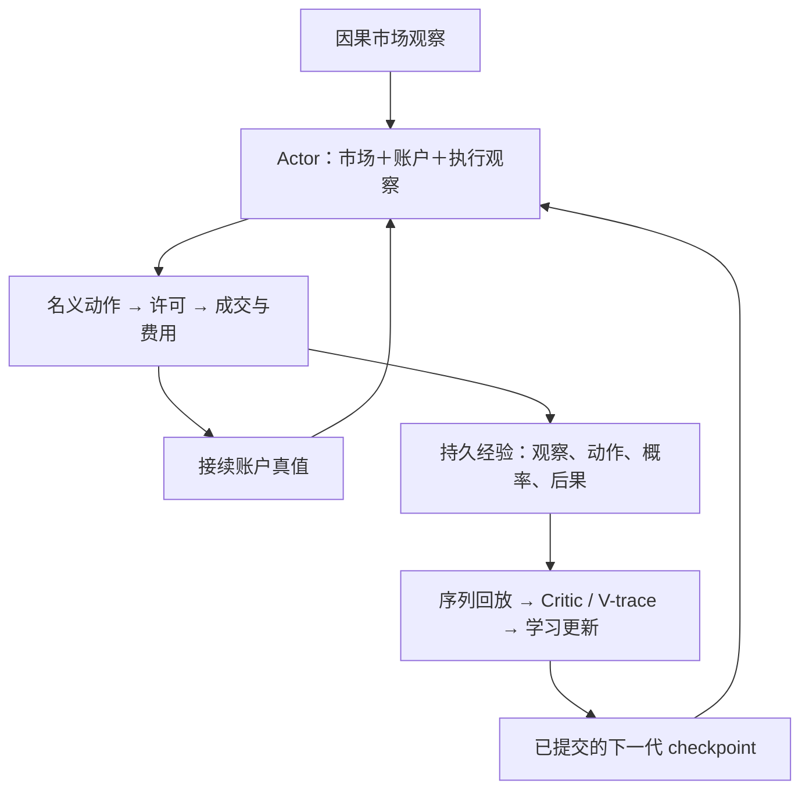

# 科学目标、学习链与技术实现地图

核对基线：main `b88c152a007bb483be5ed0f4ad6371f13e317558`（2026-09-14）；S1 静态核对版本 `a974e2803ccc2693d67a0375e460da35837636a4`，属于 PR #102，不是 main 已合入实现。状态与后继版本只在 [CURRENT_STATE](CURRENT_STATE.md) 更新。本页不授予运行权限。

## 1. 一条学习链，两个验证范围

账户沿闭环接续；新 checkpoint 只在合法换代边界启用，不能在收集单元中偷偷改权重。评价读取冻结策略的完整运行结果，和训练中的经验筛选分开。

| 范围 | 输入与目的 | 能证明什么 |
|---|---|---|
| 当前 S1 | 合成已知答案任务、小型市场/账户/执行观察，实际 durable replay 与学习更新 | 学习链是否学到账户差异、延迟后果、算术期望等受控能力 |
| 后续 S2/S3 | 已授权分钟行情、实际冻结预训练器官、合法接续账户 | S2 验证真实接线与资源；S3 才研究历史练习能否改善经济结果 |

S1 的冻结线性市场层不是预训练器官加载证明；S1 通过也不意味着历史盈利或迁移。现有 2020–2026 分钟数据的持有范围不等于全部已授权消费范围。

## 2. 科学要求如何落到现有代码

以下相对路径均位于 `cb16_local_opt/`；已合入 foundation 的资格范围见 [S0-v2 receipt](../authority/rearchitecture_r11/CB16_R11_S0V2_RECEIPT_V1.json)。模块存在不代表 S1 已通过。

| 科学要求 | 主要实现/接口 | 需要保留的证据与边界 |
|---|---|---|
| 账户后果进入下一次决策 | `cc_runtime_account_loop_r0.py`、`account_economics_r0.py`、`cc_environment_advance_r0.py` | signed equity/负债、真实成交、reject 后环境推进；same-account 顺序 |
| 联合市场与账户选动作 | `cc_policy_brain_r0.py::CCCentralBrain`、`cc_policy_distribution_r0.py` | 冻结 market 层与可训练 account/fusion 分开；nominal direction/risk 与 true log_mu |
| 事实先落盘，再形成训练样本 | `post_cc_durable_collection_v1.py`、`post_cc_observation_store_v1.py`、`post_cc_replay_materializer_v1.py` | 实际观察与账户来源可重建；不能拿进程内字典替代 durable truth |
| 成功与失败都能用于后果学习 | `post_cc_joint_replay_v1.py`、`post_cc_joint_batch_v1.py`、`post_cc_joint_policy_loss_v1.py` | 兼容性、真实行为概率、终态与抽样权重；不把所有历史无条件塞入同一 loss |
| 延迟信用与目标策略更新 | `post_cc_critic_vtrace_v1.py`、`cc_vtrace_r0.py`、`post_cc_learner_v1.py` | 边界/bootstrap、概率比、梯度归属；S1 需用实际学习验证，不能只看 loss |
| 更新提交后才能换代 | `post_cc_update_transaction_v1.py`、`post_cc_generation_continuity_v1.py` | checkpoint、optimizer/update identity、恢复幂等；同账户接续 |
| 收益排序与基准诊断分开 | `post_cc_economic_ordering_v1.py`、`post_cc_baseline_components_v1.py`、`post_cc_promotion_v1.py` | S0 后继合同已迁移；旧 `cc_economic_promotion_r0.py` 保留历史行为，不重开 owner 决定 |
| 真实受控学习与裁判 | PR #102 的 `post_cc_s1_tasks_v1.py`、`post_cc_s1_training_loop_v1.py`、`post_cc_s1_gate_compiler_v1.py` | 任务/对照/种子/预算来自冻结 manifest；完整科学 verdict 尚缺 |

## 3. 当前技术栈：事实与计划分开

| 层 | 当前可核对实现 | 起步选择 / 不应误认 |
|---|---|---|
| 数值学习 | Python + PyTorch，CCCentralBrain + 独立 SeparateCritic | CPU-only；不新增 CUDA、GPU broker、混合精度或语言迁移前置任务 |
| S1 网络 | `CCCentralBrain(2, 3, 2, 8)`，Actor 可训练 241、冻结 16；Critic 可训练 73 | 合成任务夹具，不是约 16K 产品 Brain；无显式循环记忆，不能据此认定历史观察充分 |
| 动作与更新 | 方向类别＋非 FLAT 条件 logistic-normal 风险；FLAT 为零点质量；S1 冻结 SGD | 早期 R0 的 Beta＋端点质量、Adam 和 batch 建议是历史候选，不是当前配置 |
| 持久化 | 内容寻址文件＋SQLite 索引；更新 journal/checkpoint/原子写与同步 | 不能把“含 SQLite”直接称为已采用 WAL 批量写；每个实际 store 配置须实测 |
| 并行 | S1 qualification 使用 ProcessPoolExecutor 调度独立任务；CC fast spine 是另一条已验证组件路径 | 不把 CC 合成 benchmark 吞吐当 S1 吞吐；CPU-only 不等于禁止有界多进程 |
| 机器与存储 | 3700X、16 GB RAM、SSD/HDD；GitHub Actions 调度 Shanxi Docker | SSD hot、HDD cold 的具体部署与接受状态查当前 RC2 证据；shm 仅 IPC，不作持久事实根 |
| 科学裁判 | 阶段 gate/manifest＋资格框架＋Sol 审阅 | 通用字段/hash 校验不替代任务科学证明；workflow success 不等于学会 |
| 扩展候选 | GPU、Rust/Go、Valkey、JetStream、RocksDB、OIDC 自动控制面 | 不作为当前 S1 恢复的默认依赖；只有对应任务与证据触发才实施 |

参数值来自 S1 构造与 [S0 登记](../authority/rearchitecture_r11/CB16_R11_POST_CC_S0_RECEIPT_V1.json)，不由项目名“CB16”推定。当前 Actor 市场层是 `nn.Linear` 冻结参数；它不是实际外部预训练 encoder。CPU-only 是新用户设备决定，尚不代表相应 profile 已验证。

## 4. 三种缺口，三种处理

| 缺口 | 例子 | 处理 |
|---|---|---|
| 执行缺口 | 空间/权限错误、I/O 积压、CPU profile 尚未绑定 | RC2 的有界资格与修复；不改学习目标，不报 scientific FAIL |
| 学习缺口 | 有效执行后仍学不到延迟后果、账户输入无作用 | 由 S1 已冻结判据得出结果，再版本化研究；不扩大 Infra 掩盖 |
| 历史接入/迁移缺口 | 分钟数据与真实器官未接通，观察不充分 | S2 接线与资源验证、后续表示研究；不把合成输入资格外推为市场能力 |

当前需要对齐的是这些接口及其证明范围，不是马上统一重写所有历史模块。当前 S1 科学常量保持冻结；CPU profile 落地若确需代码变更，重新审查受影响的实现身份，不能继承旧 SHA 的接受结论。

## 5. 历史基础与当前入口

CC integration 保留 W-01..W-05 和 `CC_FAST_R0_A_ORACLE_PLUS_D_SCHEDULER_BOUNDED_CHUNK_WRITER` 的语义与性能证据，见 [CC handoff](CC_INTEGRATION_HANDOFF.md)、[integration receipt](../authority/rearchitecture_r11/CB16_R11_CC_INTEGRATION_RECEIPT_V1.json)。原 16-account 合成 benchmark 不代表完整 S1 或真实器官性能。

S0 后继经济合同、S0-v2 durable foundation、S1 runner 是有明确继承关系的版本，不能混用旧 Teacher/H72 log utility、确定性入场器或 legacy performance fallback。历史模块保留追溯；新的执行入口按 CURRENT_STATE 的精确版本选择。
